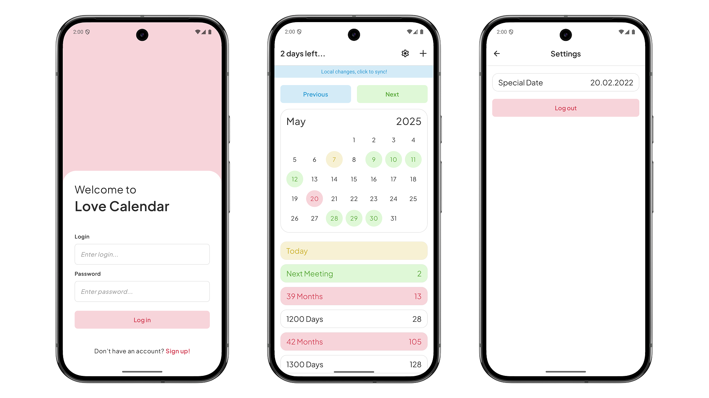

# 📱 Love Calendar

**Welcome to Love Calendar!**  
This app is designed to help couples in long-distance relationships keep track of the days remaining until their next meeting.

## 🚀 Features
- **Plan meetings with your special ones:** You and your partner can choose the date of your next meeting and see how many days are left in the app.
- **Keep track of your special dates:** Add special dates like anniversaries to be highlighted and remembered in the app.

## 🛠️ Technologies Used
Love Calendar is built with modern, efficient, and scalable technologies to ensure both high performance and maintainability:
-   **Kotlin**  — Primary language for concise and expressive code.
-   **MVI**  — Architecture for clear separation of concerns.
-   **Clean Architecture**  — Ensures maintainability and scalability.
-   **Jetpack Compose**  — Declarative UI toolkit for building interfaces.
-   **Room**  — Local database management with SQLite.
-   **Koin**  — Lightweight dependency injection framework.
-   **Material 3**  — Modern design components for UI.
-   **Coroutines & Flows**  — Handles asynchronous tasks and reactive data.

## 🚀 How to Run the Project
1.  Clone the repository:
    `git clone https://github.com/pavelmaiseichyk/LoveCalendar.git`
2.  Open the project in Android Studio.
3.  Run the app on an Android device or emulator.

## 📸 Screenshots

## 📝 License
This project is licensed under the CC BY-NC 4.0 License - see the [LICENSE](LICENSE.txt) file for details.